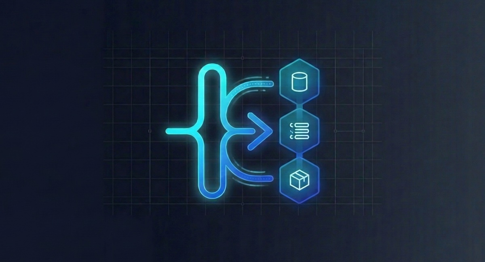

<p align="center">
  
</p>

<h1 align="center">devflow</h1>

<p align="center">Create, switch, and clean up isolated development workspaces with matching local services — one command, from branch to running database.</p>

<p align="center">
  <a href="https://clement-tourriere.github.io/devflow/">Documentation</a> ·
  <a href="docs/CLI.md">CLI reference</a> ·
  <a href="AGENTS.md">Agent guide</a> ·
  <a href="CHANGELOG.md">Changelog</a>
</p>

## What is devflow?

devflow is a workspace orchestrator for local development. Every workspace — a Git branch, a worktree, or a Jujutsu change — gets its own complete environment: service containers, connection strings, generated env files, an optional worktree directory, and stable HTTPS URLs. Created in seconds, removed with one command.

```bash
devflow switch -c feature/auth
# → branch created, worktree at ../myapp.feature_auth
# → postgres workspace cloned from main (Copy-on-Write, near-instant)
# → hooks wrote .env.local with the new DATABASE_URL
# → your shell is now inside the worktree
```

Work on multiple features, reviews, migrations, or AI-agent tasks in parallel — without sharing a database or stashing state. Drive it from the CLI, a terminal dashboard (`devflow tui`), or a desktop GUI.

## How it works

1. `git checkout feature-x` (or `devflow switch feature-x`) triggers the Git hook installed by devflow.
2. devflow creates or switches the matching service workspaces for every configured service.
3. Lifecycle hooks fire — write `.env.local`, run migrations, open a tmux window.
4. With worktrees enabled, the shell wrapper `cd`s you into the workspace directory.

Every workspace's app is reachable at a predictable HTTPS URL, every workspace's database at its own connection string — and `devflow remove` cleans all of it up.

## Highlights

- **Automatic VCS integration** — installed hooks create and switch environments on plain `git checkout`; Jujutsu (jj) is auto-detected and supported alongside Git
- **Two isolation models, chosen per service** — physical (a Copy-on-Write Docker container per workspace) or logical (one shared global engine with a database, bucket, or DB index per workspace)
- **Multi-service** — PostgreSQL, ClickHouse, MySQL, Redis, RustFS object storage, any Docker image, or custom plugin providers; cloud branching via Neon/DBLab/Xata (experimental)
- **Project processes** — workspace-scoped web servers, workers, and schedulers with native or direct Pitchfork start/stop/status/logs, ready checks, dependency ordering, port bumping, and service env interpolation
- **Managed worktrees** — per-workspace directories from a path template, with env files, gitignored caches, and AI tool configs (`.claude/`, `.cursor/`, …) copied in automatically
- **Lifecycle hooks** — MiniJinja-templated commands and built-in actions at every phase, with conditions, an approval system, and installable recipes
- **Auto-HTTPS proxy** — every Docker container and port-backed devflow process gets a trusted `https://name.local` URL that resolves the same from the host and from inside containers; no `/etc/hosts` edits, no certificate warnings
- **Controller daemon** — `devflow daemon start` keeps every registered project's shared engines and process desired state reconciled
- **Seeding** — initialize databases from a PostgreSQL URL, a local dump file, or S3
- **Built for AI agents** — `--json` and `--non-interactive` everywhere, agent launch/context/workspace-helper commands, and AI-generated commit messages

Cloud branching providers and plugin providers are newer and still maturing — check `devflow --help-all` and the changelog for what is available in your build.

## Install

```bash
curl -fsSL https://raw.githubusercontent.com/clement-tourriere/devflow/main/scripts/install.sh | sh
```

Installs the latest release binary to `~/.local/bin` (override with `DEVFLOW_INSTALL_DIR`; pin a release with `DEVFLOW_VERSION=v0.5.0`). Supported platforms: Linux (x86_64, arm64) and macOS (Apple Silicon) — see [Install from source](#install-from-source) for everything else.

Update at any time with:

```bash
devflow update          # or: devflow update --check
```

## Quick start

```bash
# 1. Initialize a project (interactive: pick services, worktrees, Git hooks)
cd ~/my-project
devflow init

# 2. Create and switch to an isolated workspace
devflow switch -c feature/auth

# 3. Inspect the current environment
devflow status

# 4. Print connection details for scripts or .env files
devflow connection feature/auth --format env

# 5. When the work is done, clean everything up in one step
devflow remove feature/auth
```

If worktrees are enabled, install shell integration so `devflow switch` can move your shell into the selected worktree:

```bash
eval "$(devflow shell-init)"
```

## Everyday commands

```bash
devflow switch                  # Pick a workspace interactively
devflow switch -c feature/api    # Create and switch to a workspace
devflow list                    # List workspaces and service status
devflow status                  # Show current workspace information
devflow connection feature/api   # Show service connection info
devflow remove feature/api       # Remove workspace resources
devflow doctor                  # Diagnose Docker, VCS, and config issues
devflow tui                     # Open the terminal dashboard
```

Run `devflow --help-all` to see advanced service, hook, proxy, agent, and config commands.

## Services

devflow can manage named services per workspace. Two models are available, per service:

- `type: local` — one Copy-on-Write Docker container per workspace (Postgres, ClickHouse, MySQL, or any image). Strong isolation, instant clones via APFS, ZFS, Btrfs, or XFS.
- `type: shared` — one global container per engine; each workspace gets a logical boundary created on the fly: a Postgres database (`CREATE DATABASE … TEMPLATE parent` keeps branch-from-parent semantics), a Redis DB index, a RustFS (S3-compatible) bucket, or a ClickHouse database.

```bash
devflow service add app-db --provider local --service-type postgres
devflow service create feature/auth
devflow service connection feature/auth
devflow service seed main --from dump.sql   # or a postgres:// URL, or s3://
devflow service logs feature/auth
devflow service reset feature/auth

devflow service up                 # ensure all shared global engines are running
devflow daemon start               # keep engines/process watch+retry running in the background
```

Connection information can be emitted as URI, env, or JSON output for scripts and tooling.

## Processes

For complex projects, devflow can also manage workspace-scoped project processes — app servers, frontend dev servers, background workers, and schedulers — without Docker:

```yaml
processes:
  auto_start: true
  daemons:
    api:
      run: "npm run dev"
      port: { expect: [3000], bump: 50 }
      ready_http: "http://127.0.0.1:3000/health"
      env:
        DATABASE_URL: "{{ service['app-db'].url }}"
    worker:
      run: "npm run worker"
      required: false
      depends: [api]
```

```bash
devflow process start --all
devflow process status
devflow process logs api --tail 100 --follow
devflow process stop --all
```

When `processes.auto_start: true`, `devflow switch` starts configured processes after services and hooks are aligned. Auto-started commands use the same approval store as hooks, so agents can pre-approve with `devflow hook approvals add "npm run dev"` or set `DEVFLOW_APPROVE_HOOKS=1`. Set `processes.provider: pitchfork` to embed Pitchfork's Rust supervisor directly (no `pitchfork` CLI subprocess) for start/stop/log handling while devflow keeps desired state, proxy records, and GUI status. Running processes with ports are also exposed through the devflow proxy as `https://<process>.<workspace>.<project>.<suffix>` (default suffix: `.local`). `devflow remove` stops workspace processes before deleting the worktree and service workspaces. Run `devflow daemon start` to keep desired-state, `watch` restart-on-change, and `retry` reconciliation active in the background. See [Project processes & Pitchfork](https://clement-tourriere.github.io/devflow/guides/processes/) and [Adding devflow to an existing project](https://clement-tourriere.github.io/devflow/getting-started/existing-project/) for Compose-to-devflow migration examples.

## Hooks and automation

Hooks run during workspace lifecycle phases such as creation and switching. They can write env files, run migrations, or execute project-specific commands — templated with MiniJinja, gated by an approval system, and available as installable recipes.

```bash
devflow hook show
devflow hook explain post-switch
devflow hook vars
devflow hook run post-create       # run a phase manually
```

## Built for AI agents

Every command supports `--json` and `--non-interactive`, and the worktree-per-task pattern gives each agent an isolated directory, database, and env file:

```bash
devflow --json --non-interactive switch -c agent/task-42   # isolated env for the task
devflow agent context --format json                        # project + connection context for the agent
devflow switch -c agent/fix-login -x claude -- 'Fix the login timeout bug'
devflow commit --ai                                        # LLM-generated commit message
devflow sync-ai-configs                                    # sync .claude/.cursor settings back to main
```

AI tool configs (`.claude/`, `.cursor/`, `.opencode/`, `.agents/`) are copied into new worktrees automatically. In `--non-interactive` mode, unapproved hooks are skipped with a warning (set `DEVFLOW_APPROVE_HOOKS=1` to auto-approve in CI/agent runs). See `AGENTS.md` for the recommended coding-agent workflow.

## Configuration

`devflow init` creates a `.devflow.yml` (a lightweight `devflow.toml` is also read). A minimal example:

```yaml
services:
  - name: app-db
    type: local
    service_type: postgres
    default: true
    local:
      image: postgres:17

worktree:
  enabled: true
  path_template: "../{repo}.{workspace}"

hooks:
  post-switch:
    env:
      action:
        type: write-env
        path: .env.local
        vars:
          DATABASE_URL: "{{ service['app-db'].url }}"

processes:
  auto_start: true
  daemons:
    api:
      run: "npm run dev"
      port: { expect: [3000], bump: 50 }
      ready_http: "http://127.0.0.1:3000/health"
      env:
        DATABASE_URL: "{{ service['app-db'].url }}"
```

A shared-engine service is one stanza — no per-workspace containers, ports, or volumes:

```yaml
services:
  - name: cache
    service_type: redis        # one global redis; a DB index per workspace
  - name: storage
    service_type: rustfs       # one global RustFS; a bucket per workspace
```

Config precedence:

1. Environment variables
2. `.devflow.local.yml`
3. `.devflow.yml` (or `devflow.toml`)

## Install from source

```bash
git clone https://github.com/clement-tourriere/devflow.git
cd devflow
cargo install --path .
```

Requirements:

- Rust toolchain
- Docker or a compatible container runtime for local services
- Optional: `bun` and Tauri prerequisites for desktop GUI development

## More examples

- `examples/simple.devflow.yml`
- `examples/multi-service.devflow.yml`
- `examples/django.devflow.yml`
- `examples/processes.devflow.yml`
- `examples/migrate-existing-app.devflow.yml`
- `docs/CLI.md`
- `AGENTS.md`

## License

MIT
